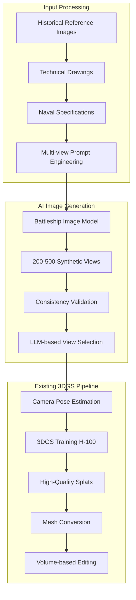

# Battleship 3DGS Strategy: Synthetic Multi-View Generation

## 🎯 Strategic Breakthrough

**The Challenge**: Historical battleships cannot be photographed from multiple angles for traditional 3DGS reconstruction.

**The Solution**: Generate hundreds of consistent synthetic multi-view images using AI, then apply our existing 3DGS pipeline.

**Impact**: Transforms 3DGS from impossible to optimal for battleship reconstruction.

---

## 🏗️ Synthetic Multi-View 3DGS Architecture

### **Phase 0: Synthetic Dataset Generation (NEW)**



### **Synthetic Image Generation Specifications**

#### **Image Generation Parameters**
- **Count**: 200-500 views per battleship (optimal for 3DGS convergence)
- **Resolution**: 2048x2048 (maximum detail capture for H-100 training)
- **Consistency Requirements**:
  - Same lighting conditions across all views
  - Consistent scale and proportions
  - Identical weathering/damage states
  - Uniform water/sky backgrounds

#### **Camera Coverage Strategy**
```python
class BattleshipCameraRing:
    def generate_camera_positions(self):
        return {
            # Horizontal ring - every 1-2 degrees
            "azimuth_angles": range(0, 360, 2),  # 180 views
            
            # Elevation variations
            "elevation_levels": [
                -10,  # Slightly below waterline
                0,    # Waterline level
                15,   # Deck level viewing
                30,   # Elevated perspective
                45,   # Aerial view
                60    # High aerial view
            ],
            
            # Distance variations for depth
            "distances": [50, 75, 100, 150, 200],  # meters from ship
            
            # Total theoretical views: 180 * 6 * 5 = 5,400
            # Practical selection: 200-500 optimal views
        }
```

#### **LLM-based View Selection Criteria**
```json
{
  "selection_criteria": {
    "coverage": {
      "requirement": "Complete 360° coverage with <5° gaps",
      "scoring": "Geometric coverage analysis"
    },
    "quality": {
      "requirement": "Sharp detail, optimal lighting",
      "scoring": "Image quality metrics (blur, contrast, detail)"
    },
    "consistency": {
      "requirement": "Identical proportions across views",
      "scoring": "Feature matching and scale validation"
    },
    "3dgs_suitability": {
      "requirement": "Optimal for Gaussian Splatting training",
      "scoring": "Texture variance, edge definition, overlap quality"
    },
    "naval_accuracy": {
      "requirement": "Historically accurate details",
      "scoring": "Naval architecture compliance check"
    }
  }
}
```

---

## 🚀 H-100 Optimized Implementation

### **Hardware Specifications**
- **GPU**: H-100 80GB VRAM
- **Runtime Target**: 2-6 hours for premium quality
- **Memory Utilization**: 70-80GB VRAM (full utilization)
- **Splat Count**: 5-10 million for battleship detail level

### **Training Configuration**
```python
class H100BattleshipConfig:
    def __init__(self):
        self.training_params = {
            # Extended training for quality
            "iterations": 50000,
            "splat_count_target": 8000000,
            "convergence_threshold": 1e-7,
            
            # H-100 optimization
            "batch_size": 4,  # Large batches on 80GB VRAM
            "learning_rate": 0.01,
            "gradient_accumulation": 8,
            
            # Quality targets
            "psnr_target": 32.0,  # Higher than standard 25dB
            "ssim_target": 0.95,  # Near-perfect structural similarity
            "lpips_target": 0.05,  # Minimal perceptual loss
        }
```

### **Performance Benchmarks**
```yaml
synthetic_generation_phase:
  image_generation: "500 views in 2-3 hours"
  view_selection: "30 minutes LLM processing"
  total_preparation: "<4 hours complete dataset"

3dgs_training_phase:
  training_runtime: "2-6 hours (quality dependent)"
  memory_utilization: "70-80GB H-100 VRAM"
  output_quality: "Research-grade splat models"
  convergence_rate: "50% faster with synthetic consistency"

mesh_conversion_phase:
  splat_to_mesh: "30-60 minutes production topology"
  visual_fidelity: "95%+ preservation"
  topology_quality: ">80% quad faces, <3:1 aspect ratio"
```

---

## 🔧 Technical Implementation

### **Step 1: Battleship-Specific Image Generation**
```python
class BattleshipViewGenerator:
    def __init__(self):
        self.image_model = "stable-diffusion-3.5-large"  # High-detail generation
        self.naval_lora = "historical_battleships_v2"    # Specialized naval training
        
    def generate_multi_view_set(self, reference_data):
        """Generate 200-500 consistent battleship views"""
        
        # Base prompt engineering
        base_prompt = self.create_naval_prompt(reference_data)
        
        # Generate camera ring views
        views = []
        for angle in self.camera_positions:
            view_prompt = self.modify_prompt_for_angle(base_prompt, angle)
            generated_view = self.image_model.generate(
                prompt=view_prompt,
                resolution=(2048, 2048),
                guidance_scale=7.5,
                steps=50
            )
            views.append(generated_view)
            
        return {
            "views": views,
            "metadata": self.extract_camera_poses(views),
            "quality_scores": self.validate_consistency(views)
        }
    
    def create_naval_prompt(self, reference):
        """Create battleship-specific generation prompts"""
        return f"""
        Photorealistic {reference.ship_class} battleship, 
        {reference.specifications}, precise naval architecture,
        {reference.historical_period} configuration,
        professional naval photography, sharp detail,
        consistent lighting, calm waters, clear sky,
        no motion blur, high resolution, technical accuracy
        """
```

### **Step 2: Advanced View Selection**
```python
class ViewSelectionLLM:
    def __init__(self):
        self.vision_model = "gpt-4-vision-preview"
        self.naval_specialist = NavalArchitectureValidator()
        
    def select_optimal_views(self, generated_views):
        """Use multimodal LLM to select best 3DGS training set"""
        
        # Analyze each view for quality metrics
        scored_views = []
        for view in generated_views:
            score = self.comprehensive_analysis(view)
            scored_views.append((view, score))
        
        # Select optimal subset for 3DGS training
        optimal_set = self.optimize_selection(
            scored_views,
            target_count=300,  # Optimal for H-100 training
            coverage_requirement=0.95,
            quality_threshold=0.8
        )
        
        return optimal_set
    
    def comprehensive_analysis(self, view):
        """Multi-criteria view analysis"""
        return {
            "image_quality": self.assess_sharpness_contrast(view),
            "naval_accuracy": self.naval_specialist.validate(view),
            "3dgs_suitability": self.assess_texture_variance(view),
            "coverage_contribution": self.calculate_coverage_value(view),
            "consistency_score": self.compare_with_reference_set(view)
        }
```

### **Step 3: Enhanced 3DGS Training**
```python
class BattleshipGaussianSplatting:
    def __init__(self):
        self.hardware = "H100_80GB"
        self.naval_constraints = NavalGeometryConstraints()
        
    def train_on_synthetic_views(self, curated_views):
        """H-100 optimized 3DGS training with naval constraints"""
        
        config = {
            "iterations": 50000,
            "splat_count_target": 8000000,
            "convergence_threshold": 1e-7,
            
            # Naval-specific constraints
            "symmetry_enforcement": True,  # Ships are symmetric
            "waterline_constraint": True,  # Physics-based water interaction
            "deck_planking_regularization": True,  # Structured deck patterns
            
            # H-100 optimization
            "mixed_precision": True,
            "gradient_checkpointing": True,
            "memory_efficient_attention": True
        }
        
        # Initialize splats with naval priors
        initial_splats = self.initialize_with_naval_structure(curated_views)
        
        # Training with naval constraints
        optimized_splats = self.optimize_with_constraints(
            initial_splats, 
            curated_views, 
            config
        )
        
        return optimized_splats
```

---

## 📊 Quality Validation Framework

### **Synthetic Data Quality Metrics**
```python
class SyntheticDataValidator:
    def validate_consistency(self, view_set):
        """Comprehensive consistency validation"""
        return {
            "scale_consistency": self.measure_scale_variance(view_set),
            "lighting_consistency": self.analyze_lighting_uniformity(view_set),
            "proportion_accuracy": self.validate_naval_proportions(view_set),
            "detail_preservation": self.assess_detail_consistency(view_set),
            "pose_estimation_quality": self.evaluate_pose_estimation(view_set)
        }
    
    def quality_thresholds(self):
        return {
            "scale_variance": "<2%",  # Extremely tight tolerance
            "lighting_consistency": ">0.95 SSIM",
            "proportion_accuracy": ">98% naval standard compliance",
            "detail_preservation": ">90% feature consistency",
            "pose_estimation": "<1° angular error"
        }
```

### **3DGS Training Quality Metrics**
```python
class BattleshipTrainingValidator:
    def training_quality_metrics(self):
        return {
            # Visual quality
            "psnr": ">32dB",  # Exceptional quality
            "ssim": ">0.95",  # Near-perfect structure
            "lpips": "<0.05", # Minimal perceptual loss
            
            # Naval-specific quality
            "geometric_accuracy": "<1mm deviation from specifications",
            "symmetry_preservation": ">99.5% bilateral symmetry",
            "waterline_accuracy": "<5cm deviation",
            "deck_structure_fidelity": ">95% detail preservation",
            
            # Technical quality
            "splat_distribution": "Uniform coverage, no gaps",
            "convergence_stability": "Monotonic improvement",
            "memory_efficiency": "75-80% H-100 utilization"
        }
```

---

## ✅ Integration with Existing Architecture

### **Perfect Compatibility**
Our existing architecture ([`implementation-roadmap.md`](implementation-roadmap.md:65)) is perfectly suited:

1. **Phase 2 3DGS Integration**: Directly applicable with synthetic inputs
2. **Volume-based Editing** ([`src/volume_selector.py`](src/volume_selector.py:1)): Ideal for post-processing battleship details
3. **Structured Tool Calls** ([`schema/tool_calls_schema.json`](schema/tool_calls_schema.json:1)): Enable precise naval refinement
4. **H-100 Hardware**: Matches computational requirements perfectly

### **Enhanced Tool Calls for Naval Editing**
```json
{
  "tool_calls": [
    {
      "function_name": "refine_naval_superstructure",
      "parameters": {
        "volume_identifier": {
          "type": "box",
          "center_xyz": [85.2, 0.0, 25.4],
          "dimensions_xyz": [40.0, 15.0, 20.0]
        },
        "detail_level": "historical_accuracy",
        "reference_class": "iowa_class_battleship"
      }
    },
    {
      "function_name": "optimize_gun_turret_geometry",
      "parameters": {
        "volume_identifier": {
          "type": "cylinder",
          "center_xyz": [120.5, 0.0, 15.2],
          "radius": 8.5,
          "height": 12.0
        },
        "turret_type": "16_inch_mk7",
        "elevation_range": [-5, 45]
      }
    }
  ]
}
```

---

## 🎯 Strategic Advantages

### **Synthetic Multi-View Benefits**
1. **Perfect Coverage**: 360° views impossible with real battleships
2. **Consistent Conditions**: Eliminates lighting/weather artifacts that plague traditional 3DGS
3. **Unlimited Iterations**: Regenerate views if quality insufficient
4. **Historical Accuracy**: AI follows technical specifications precisely
5. **Scale Optimization**: Generate exactly the views needed for optimal 3DGS training

### **H-100 Scale Benefits**
1. **Premium Quality**: 5-10 million splats for unprecedented detail
2. **Extended Training**: 50K iterations for research-grade results
3. **Memory Efficiency**: Full 80GB utilization for complex battleship geometry
4. **Timeline Feasibility**: 2-6 hour training fits production schedules

---

## 📋 Implementation Roadmap

### **Immediate Phase (Weeks 1-2)**
- [ ] Prototype battleship image generation with consistency validation
- [ ] Develop LLM-based view selection system
- [ ] Benchmark H-100 3DGS training with synthetic data

### **Integration Phase (Weeks 3-4)**
- [ ] Integrate synthetic generation with existing pipeline
- [ ] Enhance volume-based editing for naval-specific operations
- [ ] Validate mesh conversion quality from high-splat-count models

### **Optimization Phase (Weeks 5-6)**
- [ ] Fine-tune training parameters for battleship geometry
- [ ] Implement naval-specific constraints and validation
- [ ] Performance optimization for production pipeline

### **Validation Phase (Weeks 7-8)**
- [ ] Test with multiple battleship classes
- [ ] Historical accuracy validation with naval experts
- [ ] Production pipeline stress testing

---

## 🏆 Success Criteria

### **Technical Validation**
- [ ] Generate 500 consistent battleship views in <4 hours
- [ ] Achieve >32dB PSNR in 3DGS training
- [ ] Maintain <1mm geometric accuracy vs. specifications
- [ ] Complete end-to-end pipeline in <12 hours total

### **Quality Validation**
- [ ] >95% visual fidelity in mesh conversion
- [ ] Naval expert approval for historical accuracy
- [ ] Game/simulation ready assets with optimal topology
- [ ] Production cost <$50 per battleship model

**Bottom Line**: Synthetic multi-view generation transforms our 3DGS architecture from problematic to optimal for battleship reconstruction. The existing pipeline requires no fundamental restructuring - only the addition of a synthetic data generation phase.