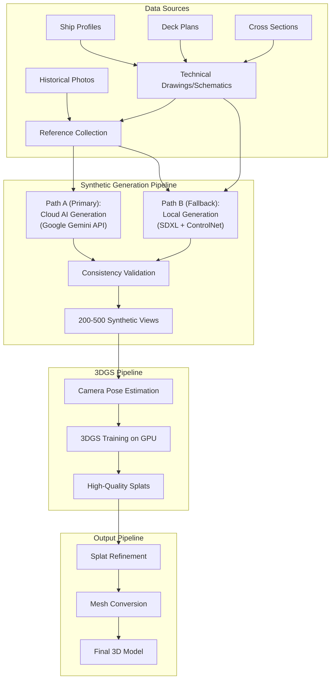

# 01 Master Architecture - Battleship 3DGS Research Prototype

## Executive Summary

This document outlines the master architecture for reconstructing historical battleships using 3D Gaussian Splatting (3DGS). Our approach solves the fundamental problem of non-existent multi-view photography by pursuing a **dual-path synthetic image generation strategy**. The primary path leverages advanced cloud-based AI (Google Gemini) for maximum quality, while the secondary path uses a local, controllable pipeline as a robust fallback.

## Core Innovation

**Problem**: Traditional 3DGS requires 50-200 photos from multiple angles - impossible for ships that no longer exist.

**Solution**: Generate synthetic multi-view datasets using a dual-path AI generation strategy. **Path A (Primary)** uses Google's Gemini model for its state-of-the-art prompt understanding. **Path B (Fallback)** uses a local Stable Diffusion pipeline with strong geometric controls.

**Key Insight**: Historical technical drawings provide exact dimensional data that photos cannot. By incorporating these as ControlNet conditioning, we ensure our synthetic images maintain precise proportions and details matching the original naval blueprints.

## System Architecture

## Technical Stack

### Hardware
- **Local Development**: RTX 3090 (24GB) + RTX 5090 (32GB)
- **OS**: Windows 11
- **RAM**: 64GB+ recommended
- **Storage**: 2TB+ for datasets and checkpoints

### Software Dependencies
- **Image Generation**: ComfyUI, Stable Diffusion XL, ControlNet (Multi-layer)
- **Cloud AI**: Google Gemini API
- **Technical Drawing Processing**: OpenCV, PIL
- **3DGS Framework**: Gaussian Splatting (Inria implementation)
- **Pose Estimation**: COLMAP
- **Mesh Processing**: Open3D, Meshlab
- **Development**: Python 3.10+, CUDA 11.8+

## Pipeline Stages

### Stage 1: Image Generation (01-image-generation/)
**Goal**: Create consistent multi-view synthetic images of Bismarck using technical drawings as ground truth

**Approach**:
1. Collect historical references and technical drawings:
   - Ship profile drawings (side elevations)
   - Deck plans (top-down views)
   - Cross-sectional diagrams
   - Detail schematics (turrets, superstructure)
2. Process technical drawings for AI conditioning:
   - Extract line art using edge detection
   - Create canonical views (front, side, top)
   - Generate proportion reference grids
3. Test multiple AI models with drawing-based conditioning:
   - SDXL + ControlNet (Canny/LineArt)
   - Use technical drawings as additional control signal
   - Ensure proportional accuracy to blueprints
4. Implement multi-layer ControlNet:
   - Layer 1: Depth maps from 3D proxy
   - Layer 2: Line art from technical drawings
   - Layer 3: Optional edge guidance
5. Generate 200-500 views with precise camera angles

**Key Innovation**: Dual ControlNet conditioning using both 3D proxy depth maps AND technical line drawings, ensuring both geometric consistency and dimensional accuracy to historical specifications.

### Stage 2: Dataset Preparation (02-dataset-preparation/)
**Goal**: Format synthetic images for 3DGS training

**Tasks**:
1. Estimate camera poses (synthetic or COLMAP)
2. Validate image consistency and coverage
3. Create camera parameter files
4. Build training manifests

**Quality Gates**:
- 360° coverage verification
- Scale consistency check
- Lighting uniformity validation

### Stage 3: 3DGS Training (03-3dgs-training/)
**Goal**: Train high-quality Gaussian splat models

**Configuration**:
- Target: 3-8M splats (memory constrained)
- Iterations: 30,000-50,000
- Quality metrics: PSNR >28dB, SSIM >0.90
- Training time: 6-12 hours on local GPUs

**Optimization Strategy**:
- Start with default hyperparameters
- Monitor convergence metrics
- Adjust learning rates based on loss curves
- Save checkpoints every 5k iterations

### Stage 4: Splat Refinement (04-splat-refinement/)
**Goal**: Clean and optimize the splat representation

**Operations**:
1. Remove floating artifacts ("floaters")
2. Optimize splat density
3. Adjust opacity thresholds
4. Color correction if needed

**Tools**: Custom Python scripts for splat manipulation

### Stage 5: Mesh Conversion (05-mesh-conversion/)
**Goal**: Convert splats to traditional 3D mesh formats

**Methods**:
- Poisson reconstruction
- Marching cubes
- TSDF fusion

**Outputs**:
- Watertight mesh (.obj, .ply)
- UV unwrapping
- Texture baking from splats

### Stage 6: Final Output (06-final-output/)
**Goal**: Package deliverables and documentation

**Deliverables**:
1. High-quality 3D models (multiple formats)
2. Rendering turntables
3. Quality metrics report
4. Technical documentation
5. Lessons learned

## Implementation Timeline

### Week 1: Image Generation Pipeline
- Day 1: Set up Google Gemini API access and test basic prompts.
- Day 2-3: Develop and refine structured prompts for multi-view generation. Generate first test batch.
- Day 4: Implement automated consistency validation and filtering for Gemini outputs.
- Day 5: Generate full 500+ view dataset with Gemini.
- Day 6-7: (Parallel/Fallback) Set up and test the local ControlNet pipeline as a baseline.

### Week 2: 3DGS Training
- Day 1-2: Set up 3DGS environment
- Day 3-5: First training runs and optimization
- Day 6-7: Achieve quality targets

### Week 3: Refinement & Delivery
- Day 1-2: Splat cleanup and optimization
- Day 3-4: Mesh conversion pipeline
- Day 5-7: Documentation and packaging

## Quality Metrics

### Synthetic Image Quality
- **Consistency**: <5% scale variation across views
- **Coverage**: No gaps >10° in viewing angles
- **Realism**: Pass manual inspection for historical accuracy

### 3DGS Reconstruction Quality
- **Quantitative**: PSNR >28dB, SSIM >0.90, LPIPS <0.1
- **Visual**: No major artifacts, clear detail preservation
- **Geometric**: Accurate proportions vs. technical drawings

### Final Mesh Quality
- **Topology**: <500k triangles, mostly quads
- **Watertight**: No holes or non-manifold edges
- **Texture**: 4K resolution, minimal seams

## Risk Mitigation

### Risk 1: Inconsistent Synthetic Images
**Mitigation**:
- **Path A (Gemini)**: Oversample views by 3-5x and use automated CLIP/LPIPS scoring to select the most consistent subset.
- **Path B (Local)**: Rely on strong ControlNet (depth, line art) conditioning for geometric stability.

### Risk 2: Poor 3DGS Convergence
**Mitigation**: Multiple training runs, hyperparameter grid search

### Risk 3: Memory Limitations
**Mitigation**: Reduce splat count targets, use gradient checkpointing

### Risk 4: Mesh Conversion Artifacts
**Mitigation**: Test multiple algorithms, manual cleanup if needed

## Success Criteria

### Minimum Viable Success
- [ ] One complete Bismarck model
- [ ] Visual quality suitable for research publication
- [ ] Basic documentation of methodology

### Target Success
- [ ] Bismarck + USS Iowa models
- [ ] Quantitative comparison with baselines
- [ ] Reproducible pipeline with scripts

### Stretch Goals
- [ ] All three ships (+ Yamato)
- [ ] Real-time viewer application
- [ ] Published paper/blog post

## Architecture Decisions

### Why Synthetic Images?
- No multi-view photos exist of historical battleships
- AI generation provides unlimited viewing angles
- Consistency controls via ControlNet ensure geometric accuracy

### Why 3DGS?
- State-of-the-art quality for photorealistic reconstruction
- Better than NeRF for discrete object modeling
- Efficient training on available hardware

### Why Local Processing?
- Full control over pipeline
- No cloud costs or API limits
- Iterative experimentation friendly

## Future Extensions

1. **VLM Integration**: Use the archived VLM-editing workflow for intelligent model refinement
2. **Multi-ship Training**: Train on multiple ships simultaneously for better generalization
3. **Interactive Viewer**: WebGL-based 3DGS viewer for results
4. **Automated Pipeline**: End-to-end script from references to final model

## Conclusion

This architecture provides a clear path from historical references to high-quality 3D models using synthetic multi-view generation and 3DGS. The modular design allows for iterative improvement and easy troubleshooting at each stage.