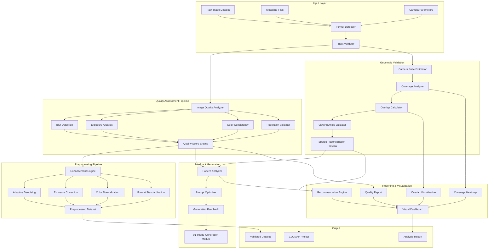

# 02 Dataset Preparation Architecture - Image Dataset Validation & Optimization Pipeline

## Executive Summary

This document defines the comprehensive architecture for preparing, validating, and optimizing image datasets for 3D Gaussian Splatting (3DGS) training. The dataset preparation pipeline ensures input images meet stringent quality requirements, provides automated validation and enhancement, and generates actionable feedback to improve synthetic image generation quality.

## Core Innovation

**Problem**: 3DGS requires high-quality multi-view image datasets with specific characteristics - poor dataset quality directly impacts reconstruction quality, but manual validation is time-consuming and error-prone.

**Solution**: Automated dataset preparation pipeline with intelligent validation, quality assessment, preprocessing, and feedback generation that ensures optimal training data while providing insights to improve future dataset generation.

**Key Insight**: By analyzing dataset characteristics and reconstruction potential before training, we can predict quality issues, provide specific improvement recommendations, and create a feedback loop that continuously improves synthetic image generation.

## System Architecture



## Technical Stack

### Hardware Requirements
- **GPU**: NVIDIA GPU with 8GB+ VRAM for neural quality assessment
- **CPU**: 8+ cores for parallel image processing
- **RAM**: 32GB minimum for large dataset processing
- **Storage**: Fast SSD with 500GB+ for dataset caching

### Software Dependencies

#### Core Libraries
```python
# Image Processing
- opencv-python==4.8.1       # Computer vision operations
- scikit-image==0.22.0      # Advanced image processing
- Pillow==10.1.0           # Image I/O and basic operations
- imageio==2.33.0          # Multi-format image support

# Quality Assessment
- pytorch==2.1.0           # Deep learning framework
- torchvision==0.16.0      # Vision models and transforms
- lpips==0.1.4             # Perceptual similarity metrics
- pytorch-fid==0.3.0       # Fréchet Inception Distance

# 3D Reconstruction
- colmap==3.8              # Structure from Motion
- open3d==0.17.0          # 3D data processing
- pycolmap==0.5.0         # Python bindings for COLMAP

# Data Analysis
- numpy==1.24.4           # Numerical operations
- pandas==2.1.4           # Data manipulation
- scipy==1.11.4           # Scientific computing
- matplotlib==3.8.2       # Plotting and visualization
- seaborn==0.13.0        # Statistical visualization

# Metadata Handling
- exifread==3.0.0        # EXIF data extraction
- pyexiv2==2.8.3         # Advanced metadata handling
```

#### Development Tools
- Python 3.10+
- CUDA Toolkit 11.8+
- COLMAP 3.8+
- FFmpeg (for video dataset support)

## Component Architecture

### 1. Dataset Input Handler

```python
class DatasetInputHandler:
    """Manages loading and initial validation of image datasets"""
    
    supported_formats = ['.jpg', '.jpeg', '.png', '.tiff', '.bmp', '.webp']
    
    def __init__(self, config: DatasetConfig):
        self.config = config
        self.metadata_parser = MetadataParser()
        self.format_detector = FormatDetector()
    
    def load_dataset(self, dataset_path: Path) -> ImageDataset:
        """Load images with metadata extraction"""
        pass
    
    def validate_structure(self, dataset: ImageDataset) -> ValidationReport:
        """Validate dataset structure and completeness"""
        pass
```

### 2. Quality Assessment Engine

```python
class QualityAssessmentEngine:
    """Comprehensive image quality analysis for 3DGS suitability"""
    
    def __init__(self):
        self.blur_detector = LaplacianBlurDetector()
        self.exposure_analyzer = HistogramExposureAnalyzer()
        self.color_validator = ColorConsistencyValidator()
        self.neural_assessor = NeuralQualityAssessor()
    
    def assess_image_quality(self, image: np.ndarray) -> QualityMetrics:
        """Perform multi-aspect quality assessment"""
        metrics = QualityMetrics()
        metrics.sharpness = self.blur_detector.measure_sharpness(image)
        metrics.exposure = self.exposure_analyzer.analyze(image)
        metrics.color_consistency = self.color_validator.validate(image)
        metrics.perceptual_quality = self.neural_assessor.score(image)
        return metrics
    
    def predict_reconstruction_quality(self, dataset: ImageDataset) -> float:
        """Predict 3DGS reconstruction quality from dataset characteristics"""
        pass
```

### 3. Geometric Validation System

```python
class GeometricValidationSystem:
    """Validates camera poses and scene coverage for 3DGS"""
    
    minimum_overlap = 0.6  # 60% overlap between adjacent views
    optimal_baseline = 0.1  # 10% of scene depth
    
    def __init__(self):
        self.pose_estimator = COLMAPPoseEstimator()
        self.coverage_analyzer = SphericalCoverageAnalyzer()
        self.overlap_calculator = FeatureBasedOverlapCalculator()
    
    def validate_camera_distribution(self, poses: List[CameraPose]) -> CoverageReport:
        """Analyze camera pose distribution and coverage"""
        pass
    
    def calculate_overlap_matrix(self, images: List[Image]) -> np.ndarray:
        """Compute pairwise image overlap ratios"""
        pass
    
    def identify_coverage_gaps(self, poses: List[CameraPose]) -> List[SuggestedPose]:
        """Identify missing viewpoints for complete coverage"""
        pass
```

### 4. Preprocessing Pipeline

```python
class PreprocessingPipeline:
    """Adaptive preprocessing to enhance dataset quality"""
    
    def __init__(self, config: PreprocessConfig):
        self.config = config
        self.denoiser = AdaptiveDenoiser()
        self.exposure_corrector = ExposureCorrector()
        self.color_normalizer = ColorNormalizer()
        self.format_standardizer = FormatStandardizer()
    
    def preprocess_dataset(self, dataset: ImageDataset) -> ProcessedDataset:
        """Apply adaptive preprocessing based on quality assessment"""
        processed = ProcessedDataset()
        
        for image in dataset.images:
            # Adaptive processing based on quality metrics
            if image.quality.needs_denoising:
                image = self.denoiser.denoise(image)
            if image.quality.needs_exposure_correction:
                image = self.exposure_corrector.correct(image)
            
            processed.add(image)
        
        return processed
```

### 5. Feedback Generation System

```python
class FeedbackGenerationSystem:
    """Generates actionable feedback for image generation improvement"""
    
    def __init__(self):
        self.pattern_analyzer = DatasetPatternAnalyzer()
        self.prompt_optimizer = PromptOptimizer()
        self.quality_predictor = QualityPredictor()
    
    def analyze_dataset_patterns(self, dataset: ImageDataset) -> PatternAnalysis:
        """Identify patterns in high/low quality images"""
        pass
    
    def generate_improved_prompts(self, analysis: PatternAnalysis) -> List[ImprovedPrompt]:
        """Generate optimized prompts for better image generation"""
        prompts = []
        
        # Lighting recommendations
        if analysis.lighting_issues:
            prompts.append(ImprovedPrompt(
                aspect="lighting",
                original="battleship in ocean",
                improved="battleship in ocean, golden hour lighting, soft shadows"
            ))
        
        # Viewing angle recommendations
        if analysis.coverage_gaps:
            for gap in analysis.coverage_gaps:
                prompts.append(ImprovedPrompt(
                    aspect="viewing_angle",
                    original="battleship view",
                    improved=f"battleship from {gap.azimuth}° azimuth, {gap.elevation}° elevation"
                ))
        
        return prompts
```

## Data Specifications

### Input Requirements

```python
@dataclass
class DatasetRequirements:
    # Resolution constraints
    min_resolution: Tuple[int, int] = (1920, 1080)
    max_resolution: Tuple[int, int] = (4096, 4096)
    aspect_ratio_tolerance: float = 0.1
    
    # Coverage requirements
    min_images: int = 50
    max_images: int = 500
    angular_coverage: float = 0.8  # 80% of viewing sphere
    
    # Quality thresholds
    min_sharpness_score: float = 0.7
    max_blur_variance: float = 0.3
    min_exposure_score: float = 0.6
    
    # Overlap requirements
    min_overlap_ratio: float = 0.6
    max_overlap_ratio: float = 0.9
    min_feature_matches: int = 500
```

### Quality Metrics

```python
@dataclass
class ImageQualityMetrics:
    # Sharpness metrics
    laplacian_variance: float      # Higher = sharper
    gradient_magnitude: float      # Edge strength
    frequency_content: float       # High-frequency ratio
    
    # Exposure metrics
    histogram_entropy: float       # Information content
    dynamic_range: float          # Utilized tonal range
    clipping_ratio: float         # Over/underexposed pixels
    
    # Color metrics
    color_cast_score: float       # Deviation from neutral
    saturation_balance: float     # Color distribution
    white_balance_error: float    # Color temperature consistency
    
    # Perceptual metrics
    neural_quality_score: float   # Deep learning assessment
    aesthetic_score: float        # Composition quality
    artifact_score: float         # Compression/generation artifacts
```

### Coverage Analysis

```python
@dataclass
class CoverageAnalysis:
    # Spherical coverage
    coverage_map: np.ndarray          # 2D spherical heatmap
    coverage_percentage: float        # Total coverage ratio
    coverage_uniformity: float        # Distribution evenness
    
    # Viewing angles
    azimuth_distribution: np.ndarray  # Histogram of azimuths
    elevation_distribution: np.ndarray # Histogram of elevations
    missing_regions: List[SphericalRegion]
    
    # Overlap analysis
    overlap_matrix: np.ndarray        # Pairwise overlaps
    average_overlap: float            # Mean overlap ratio
    connectivity_score: float         # Image graph connectivity
```

## Validation Pipeline

### Stage 1: Initial Validation

```python
class InitialValidator:
    """Fast validation of basic requirements"""
    
    def validate(self, dataset_path: Path) -> ValidationResult:
        result = ValidationResult()
        
        # Check file formats
        result.format_check = self._validate_formats(dataset_path)
        
        # Check image count
        result.count_check = self._validate_image_count(dataset_path)
        
        # Check resolution consistency
        result.resolution_check = self._validate_resolutions(dataset_path)
        
        # Quick quality scan
        result.quality_preview = self._quick_quality_scan(dataset_path)
        
        return result
```

### Stage 2: Deep Quality Analysis

```python
class DeepQualityAnalyzer:
    """Comprehensive quality assessment"""
    
    def analyze(self, dataset: ImageDataset) -> QualityReport:
        report = QualityReport()
        
        # Per-image analysis
        for image in dataset.images:
            metrics = self.assess_image_quality(image)
            report.add_image_metrics(image.id, metrics)
        
        # Dataset-level analysis
        report.overall_sharpness = self._aggregate_sharpness(report)
        report.exposure_consistency = self._analyze_exposure_consistency(report)
        report.color_consistency = self._analyze_color_consistency(report)
        
        # Generate quality heatmap
        report.quality_heatmap = self._generate_quality_heatmap(report)
        
        return report
```

### Stage 3: Geometric Validation

```python
class GeometricValidator:
    """Validate camera poses and coverage"""
    
    def validate(self, dataset: ImageDataset) -> GeometricReport:
        # Estimate camera poses
        poses = self.estimate_camera_poses(dataset)
        
        # Analyze coverage
        coverage = self.analyze_coverage(poses)
        
        # Calculate overlaps
        overlaps = self.calculate_overlaps(dataset, poses)
        
        # Generate sparse reconstruction
        sparse_model = self.generate_sparse_preview(dataset, poses)
        
        return GeometricReport(
            poses=poses,
            coverage=coverage,
            overlaps=overlaps,
            sparse_model=sparse_model
        )
```

## Preprocessing Functions

### Adaptive Image Enhancement

```python
class AdaptiveEnhancer:
    """Content-aware image enhancement"""
    
    def enhance(self, image: np.ndarray, metrics: ImageQualityMetrics) -> np.ndarray:
        enhanced = image.copy()
        
        # Adaptive sharpening
        if metrics.laplacian_variance < 0.7:
            enhanced = self._adaptive_sharpen(enhanced, metrics)
        
        # Exposure correction
        if metrics.dynamic_range < 0.6:
            enhanced = self._correct_exposure(enhanced, metrics)
        
        # Color correction
        if metrics.color_cast_score > 0.3:
            enhanced = self._correct_color_cast(enhanced, metrics)
        
        # Noise reduction
        if metrics.artifact_score > 0.4:
            enhanced = self._reduce_noise(enhanced, metrics)
        
        return enhanced
```

### Format Standardization

```python
class FormatStandardizer:
    """Standardize image formats and metadata"""
    
    standard_format = {
        'format': 'PNG',
        'bit_depth': 8,
        'color_space': 'sRGB',
        'compression': 'lossless'
    }
    
    def standardize(self, dataset: ImageDataset) -> StandardizedDataset:
        standardized = StandardizedDataset()
        
        for image in dataset.images:
            # Convert format
            std_image = self._convert_format(image)
            
            # Normalize metadata
            std_image.metadata = self._normalize_metadata(image.metadata)
            
            # Ensure consistent naming
            std_image.filename = self._standardize_filename(image.filename)
            
            standardized.add(std_image)
        
        return standardized
```

## Feedback System

### Pattern Learning

```python
class PatternLearner:
    """Learn patterns from dataset quality analysis"""
    
    def learn_quality_patterns(self, datasets: List[AnalyzedDataset]) -> QualityPatterns:
        patterns = QualityPatterns()
        
        # Identify high-quality image characteristics
        high_quality = self._filter_high_quality(datasets)
        patterns.positive_patterns = self._extract_patterns(high_quality)
        
        # Identify problematic patterns
        low_quality = self._filter_low_quality(datasets)
        patterns.negative_patterns = self._extract_patterns(low_quality)
        
        # Correlate with generation parameters
        patterns.prompt_correlations = self._correlate_with_prompts(datasets)
        
        return patterns
```

### Prompt Optimization

```python
class PromptOptimizer:
    """Generate improved prompts based on learned patterns"""
    
    def optimize_prompts(self, patterns: QualityPatterns, 
                        target_scene: str) -> OptimizedPrompts:
        optimized = OptimizedPrompts()
        
        # Lighting optimization
        optimized.lighting = self._optimize_lighting(patterns, target_scene)
        
        # Viewing angle optimization
        optimized.viewing_angles = self._optimize_angles(patterns, target_scene)
        
        # Detail level optimization
        optimized.detail_level = self._optimize_details(patterns, target_scene)
        
        # Style consistency optimization
        optimized.style_consistency = self._optimize_style(patterns, target_scene)
        
        return optimized
```

## Visual Reporting

### Coverage Heatmap Generator

```python
class CoverageHeatmapGenerator:
    """Generate visual coverage analysis"""
    
    def generate_heatmap(self, poses: List[CameraPose]) -> CoverageHeatmap:
        # Create spherical projection
        sphere_resolution = (360, 180)  # 1-degree resolution
        heatmap = np.zeros(sphere_resolution)
        
        # Project camera frusta onto sphere
        for pose in poses:
            coverage_mask = self._project_frustum(pose, sphere_resolution)
            heatmap += coverage_mask
        
        # Normalize and colorize
        heatmap = self._normalize_heatmap(heatmap)
        colored_heatmap = self._apply_colormap(heatmap)
        
        # Add annotations
        annotated = self._add_annotations(colored_heatmap, poses)
        
        return CoverageHeatmap(
            data=heatmap,
            visualization=annotated,
            statistics=self._calculate_statistics(heatmap)
        )
```

### Quality Dashboard

```python
class QualityDashboard:
    """Interactive dataset quality dashboard"""
    
    def generate_dashboard(self, analysis: DatasetAnalysis) -> Dashboard:
        dashboard = Dashboard()
        
        # Overview panel
        dashboard.add_panel(self._create_overview_panel(analysis))
        
        # Quality distribution
        dashboard.add_panel(self._create_quality_distribution(analysis))
        
        # Coverage visualization
        dashboard.add_panel(self._create_coverage_viz(analysis))
        
        # Problem areas
        dashboard.add_panel(self._create_problem_areas(analysis))
        
        # Recommendations
        dashboard.add_panel(self._create_recommendations(analysis))
        
        return dashboard
```

## Dataset Augmentation

### 3DGS-Specific Augmentation

```python
class GaussianSplattingAugmenter:
    """Augmentation techniques specific to 3DGS requirements"""
    
    def augment_dataset(self, dataset: ValidatedDataset) -> AugmentedDataset:
        augmented = AugmentedDataset()
        
        # Synthetic intermediate views
        augmented.add_all(self._generate_intermediate_views(dataset))
        
        # Lighting variations
        augmented.add_all(self._create_lighting_variants(dataset))
        
        # Controlled noise addition
        augmented.add_all(self._add_realistic_noise(dataset))
        
        # Multi-scale variants
        augmented.add_all(self._create_scale_variants(dataset))
        
        return augmented
```

## Integration Points

### Input from 01-Image-Generation

```python
class ImageGenerationInterface:
    """Interface with image generation module"""
    
    def receive_generated_images(self, generation_batch: GenerationBatch) -> ImageDataset:
        """Receive and validate generated images"""
        dataset = ImageDataset()
        
        # Extract images and metadata
        for item in generation_batch.items:
            image = Image(
                data=item.image_data,
                metadata=item.generation_metadata,
                prompt=item.prompt
            )
            dataset.add(image)
        
        # Validate generation consistency
        self._validate_consistency(dataset)
        
        return dataset
```

### Output to 03-3DGS-Training

```python
class TrainingDataInterface:
    """Interface with 3DGS training module"""
    
    def prepare_training_data(self, dataset: ProcessedDataset) -> TrainingPackage:
        """Package data for 3DGS training"""
        package = TrainingPackage()
        
        # Image data
        package.images = dataset.get_images()
        
        # Camera parameters
        package.cameras = dataset.get_camera_parameters()
        
        # Sparse point cloud
        package.sparse_cloud = dataset.get_sparse_reconstruction()
        
        # Training configuration
        package.config = self._generate_training_config(dataset)
        
        return package
```

## Performance Optimization

### Parallel Processing

```python
class ParallelProcessor:
    """Efficient parallel dataset processing"""
    
    def process_dataset_parallel(self, dataset: ImageDataset) -> ProcessedDataset:
        # Determine optimal chunk size
        chunk_size = self._calculate_chunk_size(dataset)
        
        # Create process pool
        with ProcessPoolExecutor(max_workers=cpu_count()) as executor:
            # Submit processing tasks
            futures = []
            for chunk in self._chunk_dataset(dataset, chunk_size):
                future = executor.submit(self._process_chunk, chunk)
                futures.append(future)
            
            # Collect results
            processed_chunks = []
            for future in tqdm(as_completed(futures), total=len(futures)):
                processed_chunks.append(future.result())
        
        # Merge results
        return self._merge_chunks(processed_chunks)
```

### GPU Acceleration

```python
class GPUAcceleratedAnalyzer:
    """GPU-accelerated quality analysis"""
    
    def __init__(self):
        self.device = torch.device('cuda' if torch.cuda.is_available() else 'cpu')
        self.quality_model = self._load_quality_model().to(self.device)
    
    @torch.no_grad()
    def analyze_batch(self, images: List[np.ndarray]) -> List[QualityMetrics]:
        # Prepare batch
        batch = self._prepare_batch(images).to(self.device)
        
        # Run analysis
        quality_scores = self.quality_model(batch)
        
        # Convert to metrics
        metrics = []
        for score in quality_scores:
            metrics.append(self._scores_to_metrics(score))
        
        return metrics
```

## Configuration Management

### Default Configuration

```yaml
dataset_preparation:
  validation:
    min_images: 50
    max_images: 500
    min_resolution: [1920, 1080]
    max_resolution: [4096, 4096]
    
  quality_thresholds:
    sharpness:
      min_score: 0.7
      blur_threshold: 100  # Laplacian variance
    exposure:
      min_entropy: 6.0
      max_clipping: 0.01
    color:
      max_cast: 0.3
      min_saturation: 0.2
      
  coverage:
    min_angular_coverage: 0.8
    uniform_distribution: true
    overlap_range: [0.6, 0.9]
    
  preprocessing:
    enable_denoising: true
    enable_sharpening: true
    enable_color_correction: true
    standardize_format: "PNG"
    
  augmentation:
    generate_intermediate_views: true
    lighting_variations: 3
    scale_variants: [0.8, 1.0, 1.2]
    
  reporting:
    generate_heatmaps: true
    quality_dashboard: true
    recommendation_count: 10
```

## Error Handling

### Validation Error Handling

```python
class ValidationErrorHandler:
    """Handle dataset validation errors"""
    
    def handle_validation_error(self, error: ValidationError) -> Resolution:
        if isinstance(error, InsufficientImagesError):
            return self._handle_insufficient_images(error)
        elif isinstance(error, PoorQualityError):
            return self._handle_poor_quality(error)
        elif isinstance(error, IncompleteCoverageError):
            return self._handle_incomplete_coverage(error)
        else:
            return self._handle_generic_error(error)
```

## Testing Strategy

### Unit Tests

```python
class TestDatasetPreparation:
    """Comprehensive test suite for dataset preparation"""
    
    def test_quality_assessment(self):
        """Test quality assessment accuracy"""
        pass
    
    def test_coverage_analysis(self):
        """Test coverage calculation correctness"""
        pass
    
    def test_preprocessing_pipeline(self):
        """Test preprocessing effectiveness"""
        pass
    
    def test_feedback_generation(self):
        """Test feedback quality and relevance"""
        pass
```

## Future Extensions

### 1. Active Learning Integration
- Learn from reconstruction results
- Continuously improve quality predictions
- Adaptive threshold adjustment

### 2. Real-time Processing
- Stream processing for live capture
- Immediate feedback during acquisition
- Progressive quality updates

### 3. Advanced Scene Understanding
- Semantic segmentation integration
- Object-aware quality assessment
- Context-specific recommendations

### 4. Multi-modal Support
- Video dataset preparation
- Depth sensor integration
- LiDAR data fusion

## Risk Mitigation

### Risk 1: False Positive Quality Assessment
**Mitigation**: Multi-metric validation, human-in-the-loop verification for edge cases

### Risk 2: Over-preprocessing Artifacts
**Mitigation**: Conservative enhancement parameters, quality monitoring after preprocessing

### Risk 3: Incomplete Coverage Detection
**Mitigation**: Multiple coverage analysis methods, conservative coverage estimates

### Risk 4: Scalability Issues
**Mitigation**: Efficient data structures, streaming processing, cloud computation options

## Success Criteria

### Minimum Requirements
- [ ] Validate basic dataset requirements
- [ ] Detect major quality issues
- [ ] Generate coverage analysis
- [ ] Provide preprocessing capabilities

### Target Goals
- [ ] <5% false positive rate in quality assessment
- [ ] 90% accuracy in predicting reconstruction quality
- [ ] Generate actionable feedback for all issues
- [ ] Process 1000 images in <5 minutes

### Excellence Markers
- [ ] Learn and adapt from multiple datasets
- [ ] Predict optimal camera positions
- [ ] Fully automated quality optimization
- [ ] Real-time processing capabilities

## Conclusion

This dataset preparation architecture provides a comprehensive solution for validating, analyzing, and optimizing image datasets for 3D Gaussian Splatting. By combining automated quality assessment, intelligent preprocessing, and continuous feedback generation, we ensure that only high-quality data reaches the training pipeline while providing actionable insights to improve future dataset generation. The modular design allows for easy extension and adaptation to different scene types and quality requirements.