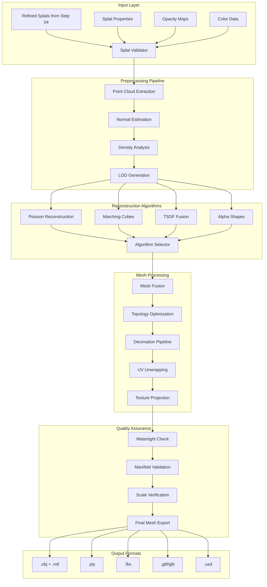

# 05 Step Architecture - Mesh Conversion Pipeline

## Executive Summary

This document defines the comprehensive architecture for converting high-quality Gaussian splat representations into production-ready 3D mesh formats. The mesh conversion pipeline bridges the gap between novel view synthesis representations and traditional 3D workflows, enabling integration with standard graphics pipelines, game engines, and CAD systems.

## Core Innovation

**Problem**: Gaussian splats, while photorealistic, are not compatible with traditional 3D pipelines that expect polygon meshes.

**Solution**: Multi-algorithm mesh reconstruction pipeline that preserves splat quality while generating watertight, UV-mapped meshes suitable for any 3D application.

**Key Insight**: Different reconstruction algorithms excel at different aspects - by combining Poisson reconstruction for smooth surfaces, marching cubes for detail preservation, and TSDF fusion for robustness, we achieve optimal results for complex historical vessel geometry.

## System Architecture



## Technical Stack

### Hardware Requirements
- **GPU**: NVIDIA RTX 3090/5090 (24GB+ VRAM for texture baking)
- **CPU**: 16+ cores for parallel mesh processing
- **RAM**: 64GB minimum, 128GB recommended for large models
- **Storage**: 500GB+ for intermediate mesh data

### Software Dependencies

#### Core Libraries
```python
# Mesh Processing
- Open3D==0.17.0          # Primary reconstruction framework
- PyMeshLab==2022.2.post4 # Advanced mesh operations
- trimesh==4.0.5          # Mesh I/O and analysis
- pyvista==0.42.3         # Visualization and processing

# Point Cloud Processing
- scikit-learn==1.3.2     # KD-trees, clustering
- scipy==1.11.4           # Spatial algorithms
- numpy==1.24.4           # Numerical operations

# Texture Processing
- opencv-python==4.8.1    # Image processing
- Pillow==10.1.0         # Texture I/O
- xatlas==0.0.7          # UV unwrapping

# Format Support
- pygltflib==1.16.1      # glTF export
- plyfile==1.0.2         # PLY format support
- pywavefront==1.3.3     # OBJ handling
```

#### Development Tools
- CUDA Toolkit 11.8+
- Visual Studio 2022 Build Tools
- CMake 3.25+
- Python 3.10+

## Component Architecture

### 1. Splat Input Handler

```python
class SplatInputHandler:
    """Manages loading and validation of refined splat data"""
    
    def __init__(self, config: MeshConfig):
        self.config = config
        self.validators = [
            DensityValidator(),
            OpacityValidator(),
            ScaleValidator(),
            ColorValidator()
        ]
    
    def load_splats(self, splat_path: Path) -> GaussianSplatData:
        """Load splat data with validation"""
        pass
    
    def extract_point_cloud(self, splats: GaussianSplatData) -> PointCloud:
        """Convert splats to weighted point cloud"""
        pass
```

### 2. Reconstruction Engine

```python
class ReconstructionEngine:
    """Multi-algorithm mesh reconstruction system"""
    
    algorithms = {
        'poisson': PoissonReconstructor,
        'marching_cubes': MarchingCubesReconstructor,
        'tsdf': TSDFReconstructor,
        'alpha_shapes': AlphaShapeReconstructor
    }
    
    def reconstruct(self, point_cloud: PointCloud, 
                   algorithm: str = 'auto') -> Mesh:
        """Execute reconstruction with specified algorithm"""
        pass
    
    def auto_select_algorithm(self, point_cloud: PointCloud) -> str:
        """Intelligently select best algorithm based on data"""
        pass
```

### 3. Mesh Processing Pipeline

```python
class MeshProcessingPipeline:
    """Post-reconstruction mesh optimization"""
    
    stages = [
        ('cleanup', MeshCleanup),
        ('remesh', AdaptiveRemeshing),
        ('decimate', IntelligentDecimation),
        ('smooth', FeaturePreservingSmoothing),
        ('uv_unwrap', OptimalUVUnwrapping),
        ('texture_bake', SplatTextureBaking)
    ]
    
    def process(self, mesh: Mesh, target_config: MeshTargetConfig) -> ProcessedMesh:
        """Execute full processing pipeline"""
        pass
```

## Data Flow Specifications

### Input Data Structure
```python
@dataclass
class SplatInputData:
    positions: np.ndarray      # (N, 3) float32
    scales: np.ndarray         # (N, 3) float32
    rotations: np.ndarray      # (N, 4) float32 quaternions
    opacities: np.ndarray      # (N,) float32 [0-1]
    sh_coefficients: np.ndarray # (N, 48) float32 for degree 3
    metadata: Dict[str, Any]
```

### Intermediate Representations
```python
@dataclass
class PointCloudData:
    points: np.ndarray         # (M, 3) float32
    normals: np.ndarray        # (M, 3) float32
    colors: np.ndarray         # (M, 3) uint8
    weights: np.ndarray        # (M,) float32
    confidence: np.ndarray     # (M,) float32
```

### Output Mesh Format
```python
@dataclass
class FinalMeshData:
    vertices: np.ndarray       # (V, 3) float32
    faces: np.ndarray          # (F, 3) int32
    uvs: np.ndarray           # (V, 2) float32
    normals: np.ndarray        # (V, 3) float32
    texture_maps: Dict[str, np.ndarray]  # diffuse, normal, etc.
    materials: List[Material]
    metadata: MeshMetadata
```

## Algorithm Specifications

### 1. Poisson Reconstruction
**Best for**: Smooth, watertight surfaces
```python
poisson_config = {
    'depth': 10,              # Octree depth (8-12)
    'scale': 1.1,             # Scale factor
    'linear_fit': False,      # Linear interpolation
    'confidence': True,       # Use point confidence
    'normalize': True         # Normalize weights
}
```

### 2. Marching Cubes
**Best for**: Detail preservation, sharp features
```python
marching_cubes_config = {
    'resolution': 512,        # Grid resolution
    'iso_value': 0.0,        # Surface threshold
    'gradient_direction': 'ascent',
    'allow_degenerate': False,
    'use_mask': True
}
```

### 3. TSDF Fusion
**Best for**: Robustness, multi-view consistency
```python
tsdf_config = {
    'voxel_size': 0.005,     # 5mm voxels
    'sdf_trunc': 0.04,       # Truncation distance
    'integrate_confidence': True,
    'color_integration': 'weighted'
}
```

## Integration Points

### Step 04 Integration (Splat Refinement → Mesh Conversion)
```python
class SplatRefinementInterface:
    """Interface with splat refinement pipeline"""
    
    expected_inputs = {
        'splat_file': 'refined_splats.ply',
        'metadata': 'refinement_metadata.json',
        'quality_report': 'quality_metrics.json'
    }
    
    def validate_refinement_output(self, output_dir: Path) -> bool:
        """Ensure refinement output meets requirements"""
        pass
```

### Step 06 Integration (Mesh Conversion → Final Output)
```python
class FinalOutputInterface:
    """Interface with final output pipeline"""
    
    provided_outputs = {
        'mesh_files': ['model.obj', 'model.ply', 'model.glb'],
        'textures': ['diffuse.png', 'normal.png', 'roughness.png'],
        'metadata': 'mesh_metadata.json',
        'quality_report': 'mesh_quality.json'
    }
    
    def package_for_delivery(self, mesh_data: ProcessedMesh) -> OutputPackage:
        """Package mesh data for final output stage"""
        pass
```

## Error Handling Strategies

### 1. Reconstruction Failures
```python
class ReconstructionErrorHandler:
    """Handle mesh reconstruction failures"""
    
    strategies = {
        ErrorType.INSUFFICIENT_POINTS: lambda: increase_splat_sampling(),
        ErrorType.NON_MANIFOLD: lambda: apply_manifold_repair(),
        ErrorType.MEMORY_OVERFLOW: lambda: switch_to_chunked_processing(),
        ErrorType.DEGENERATE_TRIANGLES: lambda: apply_mesh_cleanup()
    }
```

### 2. Quality Validation Failures
```python
class QualityValidationHandler:
    """Handle quality check failures"""
    
    def handle_non_watertight(self, mesh: Mesh) -> Mesh:
        """Repair holes and make watertight"""
        pass
    
    def handle_scale_mismatch(self, mesh: Mesh, expected_scale: float) -> Mesh:
        """Correct mesh scale based on technical drawings"""
        pass
```

## Performance Optimization

### 1. GPU Acceleration
```python
# Utilize CUDA for parallel operations
cuda_operations = {
    'normal_estimation': cuda_estimate_normals,
    'poisson_solver': cuda_poisson_reconstruct,
    'texture_projection': cuda_project_textures
}
```

### 2. Memory Management
```python
class ChunkedProcessor:
    """Process large models in chunks"""
    
    def __init__(self, max_memory_gb: float = 16.0):
        self.chunk_size = self._calculate_optimal_chunk_size(max_memory_gb)
    
    def process_chunked(self, data: np.ndarray) -> np.ndarray:
        """Process data in memory-efficient chunks"""
        pass
```

### 3. Parallel Processing
```python
from multiprocessing import Pool
from concurrent.futures import ThreadPoolExecutor

class ParallelMeshProcessor:
    """Leverage multi-core for mesh operations"""
    
    def parallel_decimation(self, mesh_chunks: List[Mesh]) -> Mesh:
        """Decimate mesh chunks in parallel"""
        with Pool() as pool:
            decimated = pool.map(self.decimate_chunk, mesh_chunks)
        return self.merge_chunks(decimated)
```

## Quality Metrics

### Geometric Quality
```python
@dataclass
class GeometricQualityMetrics:
    vertex_count: int
    face_count: int
    watertight: bool
    manifold: bool
    euler_characteristic: int
    genus: int
    surface_area: float
    volume: float
    average_edge_length: float
    aspect_ratio_distribution: np.ndarray
```

### Reconstruction Fidelity
```python
@dataclass
class ReconstructionFidelityMetrics:
    hausdorff_distance: float    # Max distance to original
    chamfer_distance: float      # Average distance
    normal_consistency: float    # Normal alignment score
    color_deviation: float       # Color preservation
    detail_preservation: float   # High-frequency detail
```

### Performance Metrics
```python
@dataclass
class PerformanceMetrics:
    total_time: float
    peak_memory_usage: float
    gpu_utilization: float
    algorithm_breakdown: Dict[str, float]
```

## Security Considerations

### 1. Input Validation
```python
class SecurityValidator:
    """Validate inputs against malicious data"""
    
    MAX_VERTEX_COUNT = 50_000_000  # Prevent memory bombs
    MAX_FILE_SIZE = 10 * 1024**3   # 10GB limit
    
    def validate_splat_file(self, file_path: Path) -> bool:
        """Check file integrity and size limits"""
        pass
```

### 2. Sandboxed Execution
```python
class SandboxedReconstruction:
    """Run reconstruction in isolated environment"""
    
    def __init__(self):
        self.resource_limits = {
            'memory': '32GB',
            'cpu_time': '3600s',
            'disk_space': '100GB'
        }
```

## Configuration Management

### Default Configuration
```yaml
mesh_conversion:
  input:
    splat_confidence_threshold: 0.1
    min_point_density: 1000
    
  reconstruction:
    default_algorithm: "auto"
    poisson:
      depth: 10
      confidence_bias: 0.5
    marching_cubes:
      resolution: 512
    tsdf:
      voxel_size: 0.005
      
  processing:
    target_vertices: 500000
    texture_resolution: 4096
    uv_padding: 4
    
  output:
    formats: ["obj", "ply", "glb"]
    coordinate_system: "y-up"
    scale_unit: "meters"
```

## Testing Strategy

### Unit Tests
```python
class TestMeshConversion:
    """Comprehensive unit test suite"""
    
    def test_splat_loading(self):
        """Test splat data loading and validation"""
        pass
    
    def test_each_algorithm(self):
        """Test all reconstruction algorithms"""
        pass
    
    def test_mesh_quality_checks(self):
        """Test quality validation functions"""
        pass
```

### Integration Tests
```python
class TestPipelineIntegration:
    """Test integration with adjacent steps"""
    
    def test_step04_to_step05(self):
        """Test splat refinement to mesh conversion"""
        pass
    
    def test_step05_to_step06(self):
        """Test mesh conversion to final output"""
        pass
```

## Monitoring and Logging

```python
import logging
from typing import Dict, Any

class ConversionMonitor:
    """Real-time monitoring of conversion pipeline"""
    
    def __init__(self):
        self.logger = logging.getLogger("mesh_conversion")
        self.metrics_collector = MetricsCollector()
    
    def log_stage(self, stage: str, data: Dict[str, Any]):
        """Log pipeline stage with metrics"""
        self.logger.info(f"Stage: {stage}", extra=data)
        self.metrics_collector.record(stage, data)
```

## Future Extensions

### 1. Neural Mesh Reconstruction
- Integrate learning-based reconstruction methods
- Train on battleship-specific geometry
- Achieve better detail preservation

### 2. Real-time Preview
- WebGL-based mesh preview during conversion
- Interactive parameter adjustment
- Live quality metrics display

### 3. Automated Quality Enhancement
- ML-based mesh repair and enhancement
- Automatic LOD generation
- Smart texture synthesis

### 4. Cloud Processing
- Distributed reconstruction for massive models
- GPU cluster support
- Streaming mesh delivery

## Risk Mitigation

### Risk 1: Memory Overflow with Large Splats
**Mitigation**: Implement streaming point cloud processing, spatial subdivision, and out-of-core algorithms

### Risk 2: Non-Watertight Meshes
**Mitigation**: Multi-stage hole filling, boundary detection, and manifold repair algorithms

### Risk 3: Loss of Fine Details
**Mitigation**: Adaptive reconstruction with local detail preservation, multi-resolution approach

### Risk 4: Texture Projection Artifacts
**Mitigation**: Advanced UV unwrapping, seam minimization, and multi-view texture blending

## Success Criteria

### Minimum Requirements
- [ ] Convert splats to valid mesh formats
- [ ] Achieve watertight geometry
- [ ] Preserve basic shape and proportions
- [ ] Export in standard formats (OBJ, PLY)

### Target Goals
- [ ] <5% detail loss vs. splat rendering
- [ ] Optimal topology for downstream use
- [ ] High-quality UV mapping
- [ ] 4K texture resolution
- [ ] <10 minute processing time

### Excellence Markers
- [ ] Photorealistic texture baking
- [ ] Museum-quality mesh topology
- [ ] Real-time preview capability
- [ ] Automated quality optimization

## Conclusion

This mesh conversion architecture provides a robust, scalable solution for transforming Gaussian splat representations into production-ready 3D meshes. By combining multiple reconstruction algorithms, implementing comprehensive quality checks, and maintaining high performance standards, we ensure that the photorealistic quality of the splat representation is preserved in traditional 3D formats suitable for any downstream application.

The modular design allows for easy algorithm swapping, performance tuning, and future enhancements while maintaining compatibility with both the upstream splat refinement and downstream final output stages.