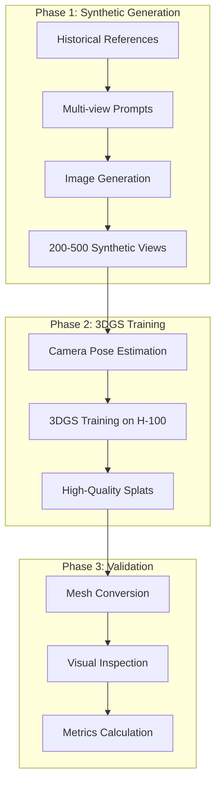

# 3DGS Research Prototype - Stakeholder Requirements

## 🎯 Research Prototype Purpose

### **Primary Goal**
Demonstrate feasibility of high-quality 3D reconstruction from synthetic multi-view images using 3D Gaussian Splatting, specifically for historical battleship models where no real multi-view photography exists.

### **Research Value Proposition**
Validate synthetic image generation → 3DGS → mesh pipeline as a viable approach for reconstructing historical objects with no available multi-view photography.

---

## 🔬 Research Stakeholders

### **1. Research Team (Primary)**
**Needs:**
- Rapid iteration on synthetic multi-view generation strategies
- High-quality 3DGS reconstruction from AI-generated images
- Quantitative metrics to validate approach
- Publishable results demonstrating feasibility

**Success Criteria:**
- Successfully reconstruct 1-3 battleship models
- Achieve visual quality suitable for research publication
- Complete prototype within H-100 GPU allocation timeframe

### **2. Academic Advisors/Reviewers**
**Needs:**
- Clear methodology documentation
- Reproducible experimental setup
- Comparative analysis with baseline approaches
- Novel contribution to the field

**Success Criteria:**
- Well-documented pipeline architecture
- Clear metrics (PSNR, SSIM, geometric accuracy)
- Demonstration of synthetic → 3DGS feasibility

---

## 📋 Research Prototype Requirements

### **Functional Requirements**

#### **FR1: Synthetic Multi-View Generation**
- **Input**: Historical reference images of battleships
- **Processing**: Multi-model testing framework:
  - Test multiple image generation services (DALL-E 3, Midjourney, Flux, SD)
  - Evaluate consistency across views
  - Select best model for production runs
- **Output**: 200-500 synthetic views per battleship
- **Quality**: Consistent lighting, scale, and proportions across views
- **Coverage**: 360° horizontal coverage with multiple elevation angles

#### **FR2: 3DGS Training Pipeline**
- **Input**: Synthetic multi-view images with estimated camera poses
- **Processing**: Local GPU optimized 3DGS training
- **Output**: High-fidelity splat representation (3-8M splats for VRAM constraints)
- **Runtime**: 6-12 hours on 3090/5090 setup
- **Quality Targets**: PSNR >28dB, SSIM >0.90 (adjusted for hardware)

#### **FR3: Basic Mesh Export**
- **Input**: Trained 3DGS model
- **Processing**: Splat-to-mesh conversion
- **Output**: Standard mesh format (OBJ/PLY)
- **Purpose**: Validate reconstruction quality
- **Quality**: Preserve visual fidelity for evaluation

### **Non-Functional Requirements (Simplified)**

#### **Performance Requirements**
- **Hardware**: RTX 3090 + 5090 local setup (24GB + 32GB VRAM)
- **Total Pipeline**: <24 hours per battleship (acceptable for research)
- **Storage**: Handle 5-10M splat models
- **Local Development**: Fully functional without cloud dependencies

#### **Documentation Requirements**
- **Code**: Basic README and setup instructions
- **Results**: Screenshots and metrics for 1-3 models
- **Methodology**: Brief technical report

---

## 🔄 Simplified Pipeline Architecture

### **Research Pipeline Flow**



### **Minimal Data Formats**

#### **Synthetic Image Batch**
```json
{
  "battleship": "USS_Iowa",
  "views": [
    {
      "image": "view_001.png",
      "azimuth": 0,
      "elevation": 15
    }
  ],
  "generation_params": {
    "model": "image_gen_model",
    "consistency_method": "multi_view_diffusion"
  }
}
```

#### **3DGS Training Config**
```json
{
  "input_images": "synthetic_views/",
  "max_iterations": 50000,
  "target_quality": "research_grade",
  "hardware": "H100_80GB"
}
```

---

## 📊 Research Success Metrics

### **Quantitative Metrics**
- **Reconstruction Quality**: PSNR >30dB, SSIM >0.95
- **Synthetic Consistency**: <5% variation in object scale across views
- **Training Convergence**: Loss <1e-6 within 50k iterations
- **Mesh Fidelity**: >90% visual similarity to splat rendering

### **Qualitative Success**
- **Visual Plausibility**: Battleship models look realistic
- **Detail Preservation**: Gun turrets, deck details clearly visible
- **No Major Artifacts**: Minimal floating splats or geometry errors

### **Research Validation**
- **Proof of Concept**: Demonstrate synthetic → 3DGS feasibility
- **Target Models** (in order):
  1. **Bismarck** - Clean historical design, well-documented
  2. **USS Iowa** - Complex due to modernizations, good test case
  3. **Yamato** - Challenge case due to fantasy interpretations
- **Basic Comparison**: Show improvement over naive approaches

---

## ✅ Prototype Completion Criteria

### **Minimum Viable Prototype**
- [x] Synthetic multi-view generation pipeline
- [ ] 3DGS training on synthetic images
- [ ] One complete battleship reconstruction
- [ ] Basic quality metrics reported
- [ ] Simple mesh export for visualization

### **Stretch Goals (If Time Permits)**
- [ ] 2-3 different battleship models
- [ ] Comparison with other reconstruction methods
- [ ] Interactive visualization of results
- [ ] Brief technical paper draft

---

## 🚀 Immediate Research Steps

### **Week 1: Image Generation Model Selection**
1. Create Bismarck reference image collection
2. Test multiple image generation models:
   - DALL-E 3: API-based, good consistency
   - Midjourney: High quality, manual process
   - Flux: Open source, local control
   - Stable Diffusion: Customizable, ControlNet options
3. Develop consistency evaluation metrics
4. Select optimal model(s) for Bismarck dataset

### **Week 2: Synthetic Dataset & 3DGS Training**
1. Generate 200+ view Bismarck dataset with chosen model
2. Implement camera pose estimation for synthetic views
3. Train first 3DGS model on 3090/5090 setup
4. Optimize for local hardware constraints
5. Iterate on hyperparameters for quality

### **Week 3: Validation & Documentation**
1. Convert to mesh and evaluate
2. Generate result visualizations
3. Document methodology and findings

---

## 🎯 Key Simplifications from Production System

### **Removed for Research Prototype:**
- ❌ Real-time performance requirements
- ❌ Multi-user support and authentication
- ❌ Production API endpoints
- ❌ Comprehensive error handling
- ❌ Cost optimization
- ❌ Enterprise integration features
- ❌ Extensive documentation
- ❌ CI/CD pipelines

### **Focused on Core Research:**
- ✅ Synthetic image → 3DGS pipeline validation
- ✅ High-quality reconstruction demonstration
- ✅ Basic metrics and evaluation
- ✅ Proof of concept for historical objects
- ✅ Single-user research tool

**Bottom Line**: This is a focused research prototype to validate that synthetic multi-view generation can produce high-quality 3DGS reconstructions of historical battleships, not a production-ready system.